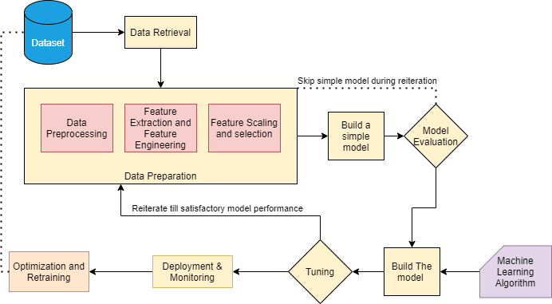

# SmartAd A/B Testing

**Table of Contents**

-   SmartAd A/B Testing
    -   [Overview](#overview)
    -   [Scenario](#scenario)
    -   [Approach](#approach)
    -   [Project Structure](#project-structure)
        -   [data](#data)
        -   [notebooks](#notebooks)
        -   [root folder](#root-folder)
    -   [Installation guide](#installation-guide)
    -   [ML Pipeline Design](#ml-pipeline-design)

## Overview

In this repository we have done A/B testing using machine learning on a dataset of users who were shown a creative ad made by the company SmartAd. This project is part of 10 academy's training week 2 challenge.

## Scenario

An advertising company is running an online ad for a client with the intention of increasing brand awareness. The advertiser company earns money by charging the client based on user engagements with the ad it designed and serves via different platforms. To increase its market competitiveness, the advertising company provides a further service that quantifies the increase in brand awareness as a result of the ads it shows to online users.

## Approach

This project is divided and implemented by the following phases

1. Setting up A/B testing framework
2. Setting up repeatable ML framework
3. Performing A/B testing with classical, sequential and Machine learning methods using MLOps best practices
4. Extracting statistically valid insights in relation to the business objective

## Project Structure

The repository has a number of files including python scripts, jupyter notebooks, pdfs and text files. Here is their structure with a brief explanation.

### data:

-   the folder where the dataset files are stored (`AdSmartABdata.csv`)

### notebooks:

-   `AdCampaignEDA.ipynb`: a jupyter notebook that explores and performs a exploratory data analysis

### root folder:

-   `.gitignore`: a text file listing files and folders to be ignored
-   `README.md`: Markdown text with a brief explanation of the project and the repository structure.

## Installation guide

```
git clone https://github.com/ProgrammingOperative/SmartAd_AB_test.git
cd SmartAd_AB_test
pip install -r requirements.txt
```

## ML Pipeline Design


